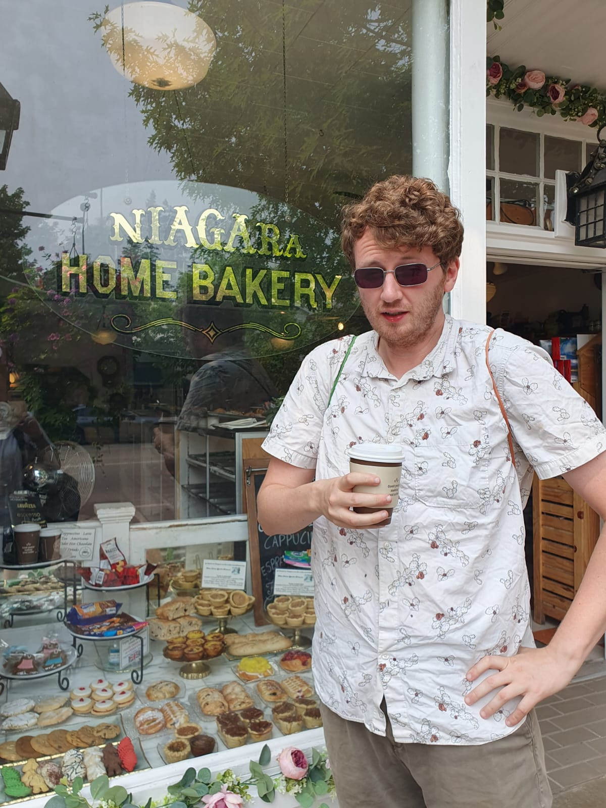

::: {.profile-intro}

{.profile-photo}

::: {.profile-text}

### PhD Student in Mathematics

**University of Rochester**

I am a PhD student in the Department of Mathematics at the University of Rochester, supervised by [Professor Arjun Krishnan](https://shirleyarjun.net/homepage/).

My research lies in stochastic analysis, with a particular focus on directed polymers in intermediate disorder and the stochastic heat equation.

You can find my CV here [CV](files/CV.pdf){.btn .btn-outline-primary}.

You can also find an academic CV here [Academic-CV](files/ACV.pdf){.btn .btn-outline-primary}.

:::

:::

## Current Research

My thesis studies scaling limits of directed polymer models and their connections with stochastic partial differential equations.

## Undergraduate Education

I received a MMath in Mathematics from the University of Sheffield, graduating with First Class Honours. During my final year, I was awarded the **T. M. Flett Prize** in recognition of achieving the highest marks in Pure Mathematics.

[Degree Certificate](files/deg.pdf){.btn .btn-outline-primary}
[T. M. Flett Prize](files/tm.pdf){.btn .btn-outline-primary}

## Teaching, Conferences and Service

During my time at the University of Rochester, I have served as a teaching assistant and instructor for a range of undergraduate and graduate courses, and have attended several conferences and summer schools in probability and stochastic analysis.

A summary of my teaching experience, conference participation, and travel support is available below.

[Teaching and Conferences](files/cat.pdf){.btn .btn-outline-primary}

I am the current AMS Chapter president for the gradute student group at the University Of Rochester. I run the Gradute student semminars; you can find the 2026 timetable here [GSS-2026](GSS2026.pdf){.btn .btn-outline-primary}. 

You can also view a broader document of all the talks I have given so for here  [Talks](files/Talks.pdf){.btn .btn-outline-primary} and extra circulum activities here [Service and Leadership](files/service_and_leadership.pdf){.btn .btn-outline-primary}

**Email:** [Rjames15 at ur.rochester.edu](mailto:Rjames15@ur.rochester.edu)  
**Office:** Hylan Building 1104  
**Department:** Department of Mathematics, University of Rochester